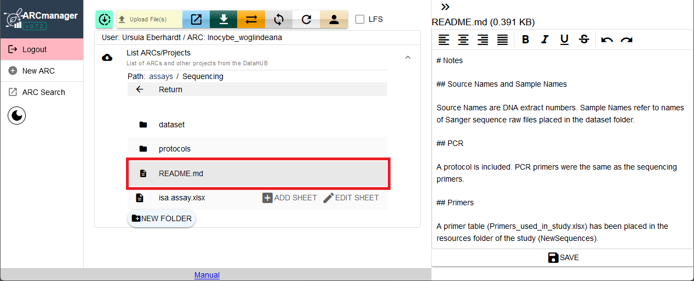

layout: docs
title: Logging in
author:
- name: Ursula Eberhardt
  github: https://github.com/UrsulaE/
  orcid: https://orcid.org/0000-0003-1221-7074
add toc: false
add sidebar: _sidebars/mainSidebar.md
status: 
date:
---

## Viewing ARCs

For the sake of simplicity, we are here using the term "ARC" for (DataHUB) "Project", because the DataHUB does not make any distinction between Projects that have the ARC folder and file structure and those that have not. Both are initially shown in the ARCmanager, but the ARCmanager has not been created for manipulating Projects which are not ARCs. These are better viewed and modified in the DataHUB directly. 

The ARCmanager is for viewing and manipulating ARCs.

Once you are logged in, you have got several options for selecting which ARCs (Projects) to view:

Fig. 1 Loading ARCS.

By pressing the button "Load ARCS" (Fig. 1), you are offered a list of all ARCs (Projects) of the DataHUB you have got the rights to view. These are the ARCs (Projects) that are either public, public within the DataHub, or of which you are a member. ARCs (Projects) owned by you are highlighted in colour.

Fig. 2 Loading your ARCS only.

By ticking the box "Your ARCs" (Fig. 2). This restricts the list to the ARCs(Projects) in which you are member. Again, ARCs owned by you are highlighted in colour.

By default, the ARCs (Project) are sorted by the date of the last changes, in descending order from latest to earliest.

Fig. 3 Arc viewing options

On the right hand side of each ARC (Project) in the list, there are two buttons:

- the lense button (Fig. 3, 1) which takes you to the ARC (Project) on the DataHUB page.

- the downward arrow button (Fig.3, 2) which expands the ARC (Project) within the ARCmanager.

### Viewing the ARC (Project) contents

Fig. 4 Expanded ARC showing directories and files.

Once you have expanded the ARC (Fig. 4) you will get a list of files and folders that are included in the ARC (the same applies to all Projects). 

Fig. 5 Hiding directories and files.

Clicking anywhere in the header row (Fig. 5) will hide this list.

Fig. 6 ARCmanager, displaying the content of README.md in the panel on the right.

If you are selecting a file that can be read by ARCmanager (.xlsx, any kind of text file including e.g. .md), the content of the file can be displayed within the ARCmanager (Fig. 6 and 7). For text files, upon clicking on the file name, the contents of the file can be viewed and edited in the panel to the right (Fig. 6).

Fig. 7 ARCmanager, displaying the administrative worksheet of the isa.assay.xlsx file in the panel on the right. 

The administrative page of of isa formatted .xlsx files, upon clicking on the file name, can be viewed and edited in the  panel to the right (Fig. 7). Ticking "alternative" will show the fields in list view.

Fig. 8 ARCmanager with the button opening the righthand panel highlighted.

If no readable file is selected, the button (Fig. 8) will display the list of changes (i.e. commit messages) of the ARC (Project) if this option is ticked. Try it out!

Fig. 9 ARCmanager with the return button highlighted.

The return button will take you up one level in the folder hierarchy up to the file and folder list of the ARC (Project).

