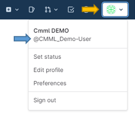
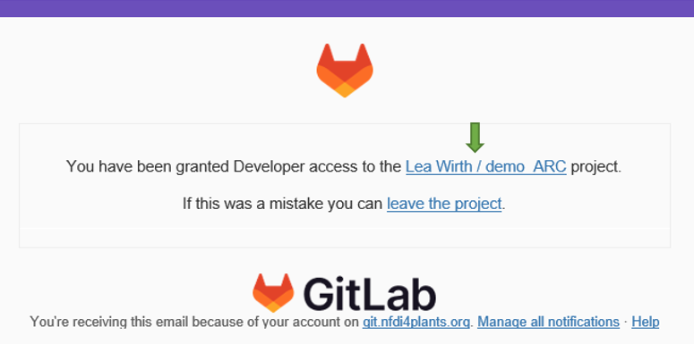
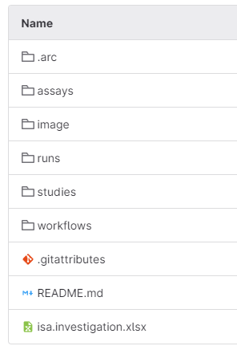
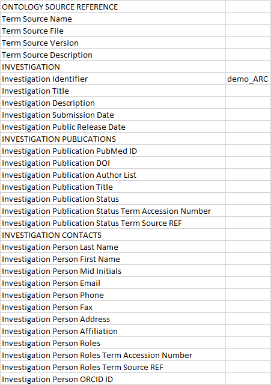

## 👥Cooperation - User regulation
All cooperations are incumbent upon the ["Nutzerordnung"](https://www.plant-biochemistry.hhu.de/facilities/metabolic-profiling/nutzerordnung).

Excerpt of ["Nutzerordnung"](https://www.plant-biochemistry.hhu.de/facilities/metabolic-profiling/nutzerordnung):

>" Das CEPLAS metabolomics & metabolism laboratory (CMML) ist Teil der Infrastruktureinheit „Technologie-Plattform: Pflanzenstoffwechsel und Metabolomik“ des Cluster of Excellence on Plant Sciences (CEPLAS) sowie des Instituts Biochemie der Pflanzen. Die Aufgabe des CMML ist die Bereitstellung und Entwicklung analytischer Methoden im Bereich Stoffwechselanalytik (Metabolomics) mit besonderem Fokus auf sogenannte Primärmetabolite. Des Weiteren unterstützen wir Forschende des Clusters und der Heinrich-Heine-Universität im Bereich Experimentdesign und Probenaufarbeitung in dem interdisziplinären Umfeld der Lebenswissenschaften (v.a. Pflanzenbiologie, Mikrobiologie, Medizin). Eine Nutzung durch externe Forschergruppen ist nach Absprache ebenfalls möglich. "

***
## 🌐 ARC - Annotated Research Context

DataPLANT provides with the Annotated Research Context (ARC) an Research Data Management (RDM) platform after the FAIR principle. The CMML  implements the ARC for cooperations. The aim is to exchange samplesheets, workflows, protocols and share (meta-)data inside a common and shareable folder structure.

:bulb: For more information about ARC click [here](https://nfdi4plants.org/nfdi4plants.knowledgebase/docs/implementation/AnnotatedResearchContext.html).

The previously created ARC will be shared with you over the [DataHUB platform](https://git.nfdi4plants.org/). Please read the following setup and complete the next steps.

***

## 👣 Setup

1. At first you have to create a DataHUB account. Sign up [here](https://auth.nfdi4plants.org/realms/dataplant/protocol/openid-connect/auth?client_id=gitlab-fr&nonce=356a5879964601fc6c507a0e1b9338d3&redirect_uri=https%3A%2F%2Fgit.nfdi4plants.org%2Fusers%2Fauth%2Fopenid_connect%2Fcallback&response_type=code&scope=openid%20profile%20email&state=38af8e237dfa652df91fa72afb2eeb66)!

    :bulb: You can also log in with your scientific account ORCID or Life Sciences!

2. If you have sucessfully created your account you can check on the website at the top left (yellow arrow) your _@username_ (blue arrow).

> 

3. Commit this _@username_ to the CMML to get started with the common ARC

    ✉️ You will recieve an e-mail after the access for the ARC was granted

4. Follow the link (green arrow) in the e-mail and log in with your DataHUB account.

> 

5. Read and follow the next instructions - 📘 [User Guide](cmml-quickstart.md/#📘-user-guide)

***
## 📘 User Guide

### 📖 Introduction
The ARC always has a specific folder structure that consists of: 
- studies
- assays
- workflows 
- runs 
   
It can also contain project-specific folders like 'images' or 'literature'.

 > 

The following guide will help you to get started to work with ARC.

### 📖 isa.investigations.xlsx

This workbook records the metadata of the whole project. In the first part it stores information about the whole project. It includes an Identifier, Title and Description and also publication data - if published. There is also a part for personal data. Here each column is deticated to a person and it can be filled out manually.

❗ For the other parts it is recommended to use ARC Commander (**done by the CMML**) for adding the metadata and it should not be filled out manually. 

Please follow the next instructions: 

### 📖 studies

### 📖 assays 

 
