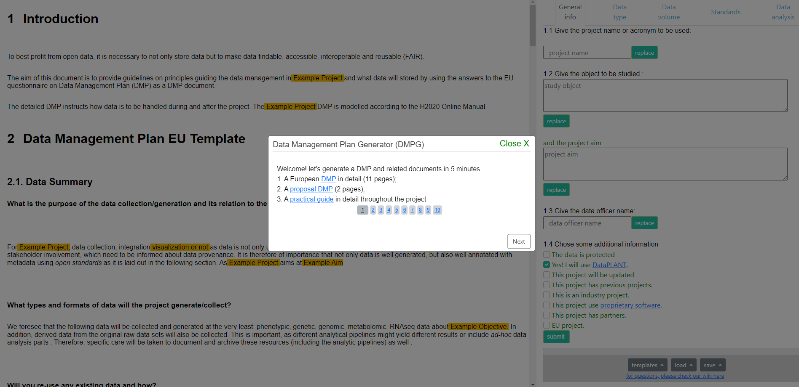

A data management plan (DMP) structures the handling of research data in a scientific project and describes how to deal with the data during and after the end of the project. Many third-party funders, such as DFG, Horizon Europe, or BMBF expect you to provide information on the handling of research data as part of your funding application. Not only is a DMP by now mandatory for a DFG funding in plant sciences, it is always beneficial for your work on a research project.

## Advantages of a DMP

A DMP allows you to track the current status of data within your project throughout its entire lifecycle. Thus, it is also helpful for the administration and to keep an overview. Scientific practice shows that you generally profit from the effort spent on better structuring, documentation, and organization of your research data, if you [FAIRify][kb-FairDataPrinciples] and thereby, lower the hurdles of reusing your datasets. Additional personnel, technical, or infrastructural resources required for compliance with your DMP can usually be claimed in third-party funding applications.

- Enables access to certain funding lines
- Facilitates documentation for reporting requirements
- Simplifies your own subsequent use of data by specifying clear structures
- Reduces the risk of data loss through defined data handling
- Improves knowledge management in the event of personnel changes
- Increases the number of citations through regulated reuse/licensing for third parties

## Elements of a DMP

When setting up your own data management plan it will be advantageous to know best practices. Many funders have specific requirements and templates for a DMP, which make it easier to follow these practices and the broad range of data management aspects. A DMP can contain the following information

- Project scope: A collection of objectives, sponsors, partners, project managers, and duration of your project.
- Data description: A description of the information to be gathered, the type and scale of the data that will be generated, and information on how data will be generated or collected.
- Existing data: A survey of existing data relevant to the project and a discussion of whether and how these data will be integrated.
- Format: Formats in which the data will be generated, maintained, and made available, including a justification for the procedural and archival appropriateness of those formats.
- Metadata: A description of the metadata to be provided along with the generated data, and a discussion of the metadata standards used.
- Storage and backup: Storage methods and backup procedures for the data, including the physical and virtual resources and facilities that will be used for the effective preservation and storage of the research data, incl. file naming and versioning as well as synchronization and collaborative working.
- Security: A description of technical and procedural protections for information, including confidential information, and how permissions, restrictions, and embargoes will be enforced.
- Resources: An overview of details of your anticipated costs for DMP compliance, including staff, metadata creation, digital curation services, and archiving.
- Responsibility: Names of the individuals responsible for data management in your research project.
- Intellectual property rights: Entities or persons who will hold the intellectual property (IP) rights to the data, and how IP will be protected if necessary. Any copyright constraints should be noted.
- Access and sharing: A description of how data will be shared, including access procedures, embargo periods, technical mechanisms for dissemination and whether access will be open or granted only to specific user groups. You should also provide a timeframe for data sharing and publishing.
- Archiving and preservation: The procedures in place or envisioned for long-term archiving and preservation of the data, including succession plans for your data in case the expected archiving entity is closed.

## DataPLANT's Data Management Plan Generator

You can write your DMPs offline by using the downloaded template of a funding agency in a text document format. However, a number of web-based DMP tools are currently available that greatly facilitate the process, as they use different templates.
DataPLANT helps the community by providing a Data Management Plan Generator on their own with various building blocks, available under <https://nfdi4plants.org/dmpg/>. The tool provides guidance throughout the writing process, as it is a living document. When opening the tool, users first need to select the type of document they want to generate: a detailed european DMP, a short proposal DMP, or a detailed guide through the project. Depending on the choice, the tool will restructure the document and point out errors when information is missing. The tool also gives the possibility to save the document in different formats during or after completion

## Sources and further information

- [DataPLANT's DMPG](https://nfdi4plants.org/dmpg/)
- [DFG: Handling of Research Data](https://www.dfg.de/en/research_funding/principles_dfg_funding/research_data/index.html)
- [forschungsdaten.info - Der Datenmanagementplan](https://www.forschungsdaten.info/themen/informieren-und-planen/datenmanagementplan/)
- [RDMkit - Data management plan](https://rdmkit.elixir-europe.org/data_management_plan.html)
- [Elements of a DMP](https://www.icpsr.umich.edu/web/pages/datamanagement/dmp/elements.html)

<!-- Knowledge base cross-references -->

[kb-FairDataPrinciples]: ../fundamentals/FairDataPrinciples.html "FAIR Data principles"

<!-- DataPLANT web links -->

<!-- Reference web links -->