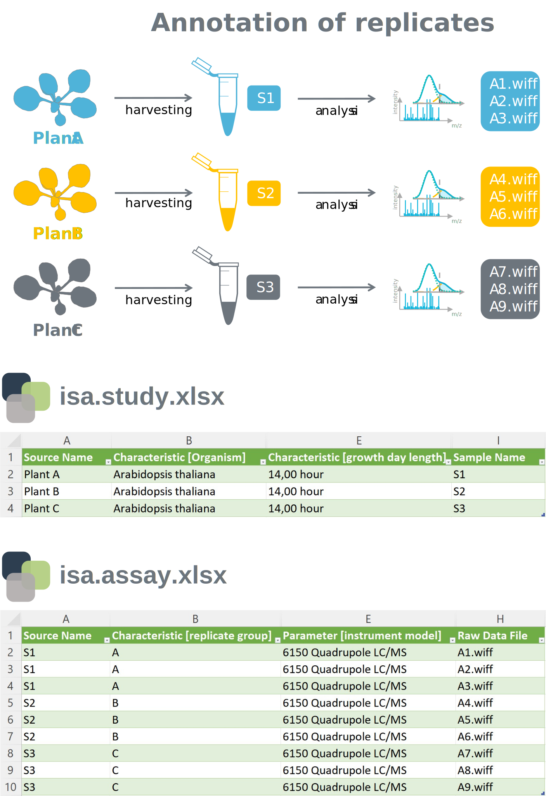
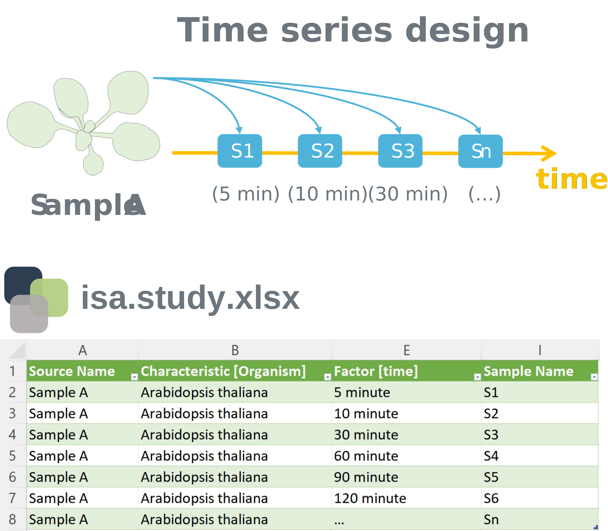
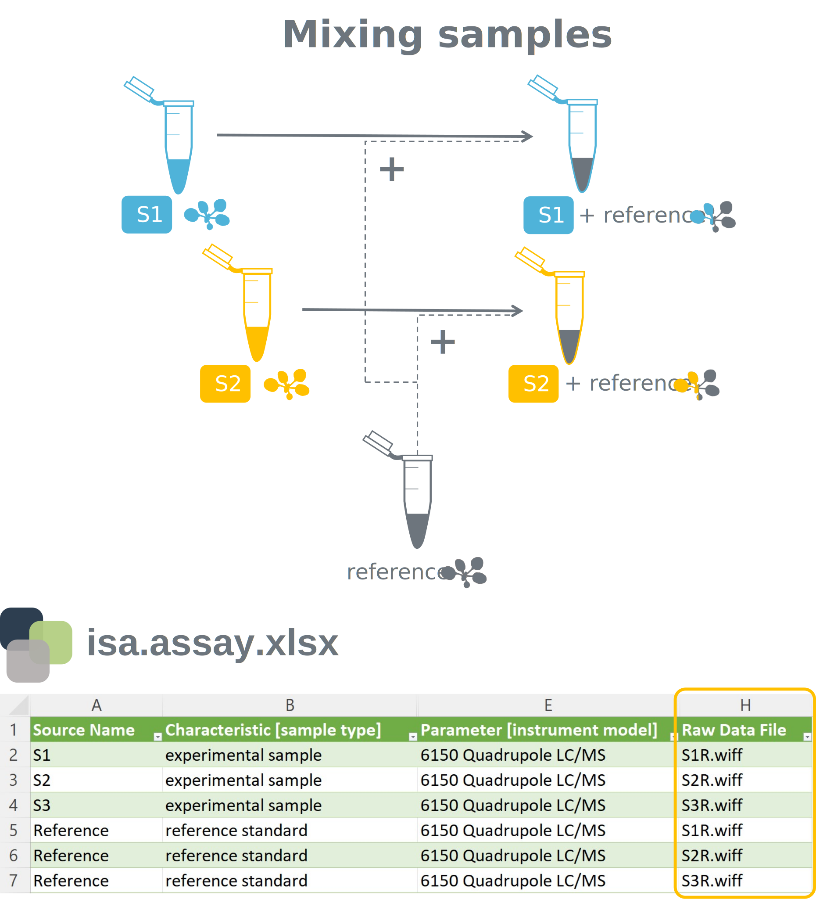

## About this guide

In this guide, we will take a closer look at some experimental scenarios that every scientist might face on a more or less regular basis. With these examples, we aim to provide you with the best practices for  data annotation in isa.study.xlsx and isa.assay.xlsx files allowing you to generate machine-readable and thereby, interoperable and reproducible data. Do not hesitate to contact us if you think that we are missing some urgent examples or if you have any further questions.

<a href="./index.html">
    UserNewbie
    ModeRead
</a>
 
 

## Annotation of biological and technical replicates

In our first scenario we focus on annotating the origin and relationship between biological and technical replicates within a fictional study. We started with three biological replicates (Plant A, Plant B, and Plant C) of the model organism *Arabidsopis thaliana* (Characteristic [Organism]), which were grown under particular conditions (Characteristic [growth day length]). Harvesting of the plants or particular parts resulted in three samples: S1, S2, and S3. These information were stored within the isa.study.xlsx file.

Subsequent proccesing steps, mostly omitted here for better clarity, are stored within one or multiple isa.assay.xlsx files. In our scenario, three technical replicates of each sample were analyzed via LC/MS (Parameter [instrument model]), generating nine raw data files. 

**It is very important to group these technical replicates and thus annotate their common origin.** If you would falsely name the individual technical replicates as A, B and C, you could run into trouble during your computational analysis.

## Annotation of time series experiments
In this rather simple scenario we take a look at the annotation of time coure patterns. Let's imagine a study in which our plant (Sample A) was exposed to stress (high light, salt, ...) for a given time. To investigate the cellular response, you harvested samples at various time points after exposure to the stressor: S1 is harvested after 5 minutes, S2 after 10 minutes, and so on. 

You should use the Factor building block in such a case to annotate the time after exposure and thereby the sampling point in the isa.study.xlsx file, as this time period will ultimately result in the given output, when all remaining parameters for treatment and analysis were identical.

## Annotation of mixed samples
This example can be of relevance when you are carrying out labeling experiments or when you are spiking your samples with an internal standard for absolute quantification. The isa.assay.xlsx file below displays the best practice for annotating the mixing of experimental samples with a reference prior to LC/MS analysis.  

By listing every raw data file twice, it becomes clear that the analyzed samples originated from the combination of an experimental sample and a reference, e.g. spiking of S1 with the reference resulted in the data file S1R.wiff.  

