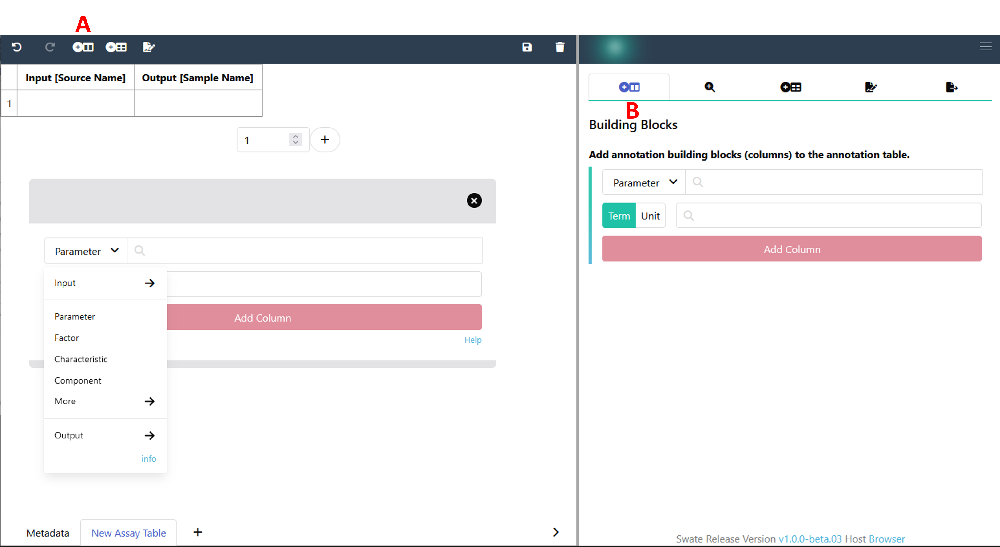

## About this guide

DataPLANT provides the tool [Swate](./../implementation/Swate.html) to support you in data annotation. It is both integrated into [ARCitect](https://nfdi4plants.org/nfdi4plants.knowledgebase/docs/ARCitect-Manual/index.html) and available as a [browser version](https://swate-alpha.nfdi4plants.org/).
In this walk-through, we guide you through annotating data using [Swate](./../implementation/Swate.html) with a show-case example.

<a href="./index.html">
    <span class="badge-category">User</span><span class="badge-selected" id="badge-newbie">Newbie</span>
    <span class="badge-category">Mode</span><span class="badge-selected" id="badge-walkthrough">Walk-through</span>
</a>

<br>
<br>

## Before we can start

<div id="before-start">

- :bulb: Consider reading about [Swate](./../implementation/Swate.html)

Create and/or open an annotation table as described in the [Swate Quickstart](https://nfdi4plants.org/nfdi4plants.knowledgebase/docs/guides/swate_QuickStart.html)
<br>

## Swate Overview

<figure>
  
  <figcaption>Major areas of the Swate user interface.</figcaption>
</figure>
<br>

<!-- 
## A small detour on "Excel Tables"

Swate uses Excel's "table" feature to annotate workflows. Each table represents one *process* from input (e.g. plant leaf material) to output (e.g. leaf extract).

Example workflows with three *processes* each:

- Plant growth &rarr; sampling &rarr; extraction
- Measured data files  &rarr; statistical analysis  &rarr; result files

> :bulb: Excel tables allow to group data that belongs together inside one sheet. This is not to be confused with a (work)sheet or workbook.
> ```bash
> workbook              (e.g. "isa.assay.xlsx")
>  └─── worksheet       (e.g. "plant_growth")
>           └─── table  (e.g. "annotationTable")
> ``` -->

## Add building blocks to create your annotation table

Each annotation should start with an *Input* and end with an *Output* column. To add and specify your *Input* building block, click either the "Add Building Block" widget on the top (A) or use the "Building Blocks" function in the sidebar (B). Select *Input* from the drop-down menu instead of *Parameter* and select *Source Name* as input type. Then click <kbd>Add column</kbd>. Add *Output [Sample Name]* analogously. 



<br>

> :bulb: Only one *Input*, one *Output* and one of each *Protocol* columns can be added per table.
<br>

Now, let's add a descriptive building block.
1. Select *Component* from the drop-down menu.
2. Search for `instrument model` in the search bar. This search looks for suitable terms in our ontology database.
3. Select the term with the id `MS:1000031` and, 
4. Click <kbd>Add column</kbd>.

> :bulb: This adds three columns to your table, one visible and **two** hidden. The hidden columns contain the ontology references. You can view the hidden columns by clicking the two arrows (>>) in the first column.


## Add a building block with a unit

1. In the "Building Blocks" tab, re-select *Parameter*, search for `sample volume` and select the term with id `MS:1000005`.
2. Activate the "Unit" box and search for `microliter` in the adjacent search bar.
3. Select `UO:0000101`.
4. Click <kbd>Add column</kbd>.

> :bulb: This adds four columns to your table, one visible and **three** hidden.
<br>
> :bulb: When filling any cell below `Parameter [sample volume]` you can now see the numbers being complemented with the chosen unit, e.g. `10.00 microliter`.
<br>

## Change the order of your columns or delete columns

At this point, your table should look similar to this:


We now want to move the *Output* column to the end of your table. For this, right-click into any cell (except the header) of the column that you want to move. Now you can click "Move Column" and select the position that the column should be moved to (in this case: 3). If your table does not contain empty cells yet, you can add any number of rows with the plus symbol. Right-clicking into cells also gives the option of deleting a column or row.
<br>

## Use a template

1. Use the "Add Template" widget on the top or navigate to "Templates" in the sidebar and click <kbd>Browse database</kbd>.

2. Search for and select `Proteomics MassSpec assay` .
    - You will see a preview of all building blocks which are part of this template.
3. Click <kbd>Add template</kbd> to add all building blocks from the template to your table, which <u>do not exist yet</u>.

If there are any building blocks which do not fit your experiment you can delete the columns as described above.
<br>

## Your ISA table is ready to fill 🎉

Go ahead, adjust the building blocks you want to use to describe your experiment as you see fit. Insert values for *Input* and *Output* and fill the cells of your *Parameter*, *Characteristic* or *Component* columns using the ontology term search. You can activate the ontology term search directly in the cells of your table with the magnifying glass symbol or you can use the "Ontology term search" in the side bar. Instructions for annotating your data can also be found in the [Swate Quickstart](https://nfdi4plants.org/nfdi4plants.knowledgebase/docs/guides/swate_QuickStart.html) and in the Swate Manual ([Filling cells with ontology terms](https://nfdi4plants.org/nfdi4plants.knowledgebase/docs/SwateManual/Docs04-Ontology-Term-Search.html)).

