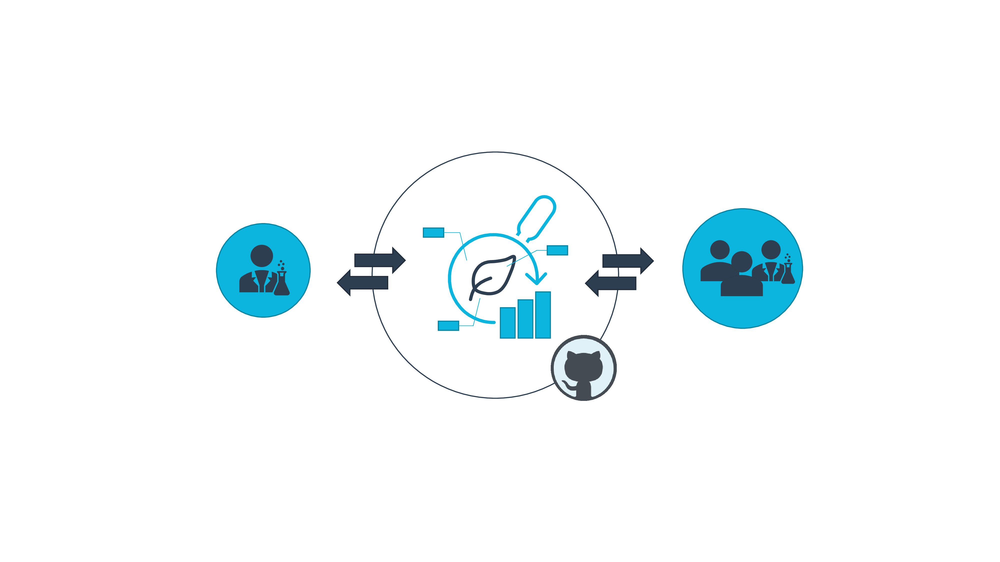

- Let people generate ARCs between Day 1 and Day 2
- Start Day 2 with "ARC Feedback session"
  - learn from things that did / did not go well
  - collect issues and "live" transfer them to GitHub => open source your research


---

# Part 1: Prepare your ARC

---

## Your fresh ARC folder

1. 💻 Create a new folder, which you want to initialize as an ARC.
2. 💻 Open the command line inside the folder or navigate via command line to that folder.

For example:
```bash
mkdir -p ~/Desktop/workshop-arcs/my-arc
cd ~/Desktop/workshop-arcs/my-arc
```

---

## ARC initialization

Initialize your ARC by executing

```bash
arc init
```

---

## Upload your local ARC to the DataHUB

In order to connect your local ARC with a remote ARC, you can specify the remote address with the flag `-r` followed by the URL of the remote ARC

```bash
arc sync -r https://git.nfdi4plants.org/<username>/my-arc
```

---

## Successful ARC synchronization

Check if the upload was successful by visiting your ARC at the respective URL in your browser.


---

# Part 2: Adding subfolders for your data

---

## Preparation

Before you can fill your ARC, let's revise your data. 

- What is my **investigation**?
- What is my **study**?
- Which **assay** did I perform?
  - What is my (raw) **dataset**?
  - What **protocol**s did I use?

> :bulb: It might help to have this info ready in a text file.   In particular, try to think about useful identifiers for investigation, study and assay.


---

## ISA investigation

The ISA investigation (`-i`) workbook allows you to record administrative metadata of your project. Add the isa.investigation.xlsx workbook including an identifier to your ARC with

```bash
arc investigation create --identifier <YourInvestigationID>
```
:bulb: Avoid using spaces in the identifier. Use underscores and capital letters instead.

---

## ISA studies and assays

The ISA study (`s`) and ISA assay (`a`) workbooks allow you to annotate your experimental data.

---

## Adding a study

Add a study folder with the isa.study.xlsx workbook including an identifier to your ARC with

```bash
arc s add --studyidentifier <YourStudyID>
```
  
---

## Adding an assay

Add an assay folder with the isa.assay.xlsx workbook including an identifier to your ARC with

```bash
arc assay add --studyidentifier <YourStudyID> --assayidentifier <YourAssayID>
```

:bulb: An assay must be linked to a study. If a study does not exist, it will be created automatically in this step.

---

## ISA studies and assays

The ARC Commander adds subdirectories to the *studies* and *assays* folders. Your ARC should, look similar to this now:  


These steps can be repeated to add as many studies and assays as needed. Accordingly, more subdirectories will be added

---

## Sync your ARC to the DataHUB

To save the changes, sync the ARC to the DataHUB including a message (`-m`).

```bash
arc sync -m "initiate arc structure"
```

🌐 Check your ARC in the DataHUB.

---

# Part 3: Structure your data

---

## Start adding your data to the ARC

Try to place your resources, datasets and protocols for each study and assay in the respective folders.

> :bulb: This part will likely require some iteration. 🗣️ Talk to us.
>
> - You might need to add new studies and assays or revise your overall structure during the process
> - Sometimes you might not immediately find a suitable position for your data
> 


---

# Part 4: Invite collaborators

* Unless changed, your ARC is set to private by default. 
* To collaborate, you can invite lab colleagues or project partners to your ARC by following the steps on the subsequent slides. 
* To get started [sign in](https://auth.nfdi4plants.org/realms/dataplant/login-actions/registration?client_id=account&tab_id=4bQkU161waI) to the DataHUB and open the ARC you want to share.

---

1. Click on **Project Information** in the left navigation panel


---

2. Click on **Members**


---

3. Click on **Invite members**


---

4. Search for potential collaborators


---

5. Select a role 


<!-- Source to slide(s) -->
<!-- ../../bricks/datahub_invite-collaborators.md -->


---

## Choosing the proper role

<u>Guest</u>
Have the least rights. This is recommended for people you ask for consultancy.

<u>Developers</u> 
The choice for most people you want to invite to your ARC. Developers have read and write access, but cannot maintain the project on the DataHUB, e.g. inviting others.

<u>Maintainers</u> 
Gives the person the same rights as you have (except of removing you from your own project). This is recommended for inviting PIs or group leaders allowing them to add their group members for data upload or analysis to the project as well.

*A detailed list of all permissions for the individual roles can be found [here](https://docs.gitlab.com/ee/user/permissions.html)*

<!-- Source to slide(s) -->
<!-- ../../bricks/datahub_choose-collaborator-role.md -->


---

## <div align="center">Congratulations!</div>
<div align="center">You have just shared your ARC with a collaborator.</div>

<style scoped>

section p img {
width: 1000px;
height: 300px;
object-fit: cover;
object-position: 100% 45%;
/* display: block; */;
}
</style>



<!-- Source to slide(s) -->
<!-- ../../bricks/datahub_congrats-for-sharing.md -->


---

## Contributors 

Slides presented here include contributions by 

- Dominik Brilhaus | [GitHub](https://github.com/brilator) | [ORCID](https://orcid.org/0000-0001-9021-3197)
- Cristina Martins Rodrigues  | [GitHub](https://github.com/CMR248) | [ORCID](https://orcid.org/0000-0002-4849-1537)
- Martin Kuhl  | [GitHub](https://github.com/Martin-Kuhl) | [ORCID](https://orcid.org/0000-0002-8493-1077)
