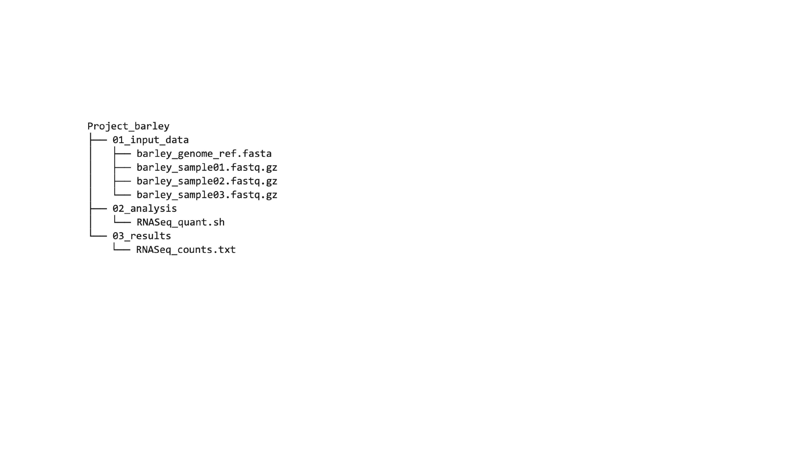
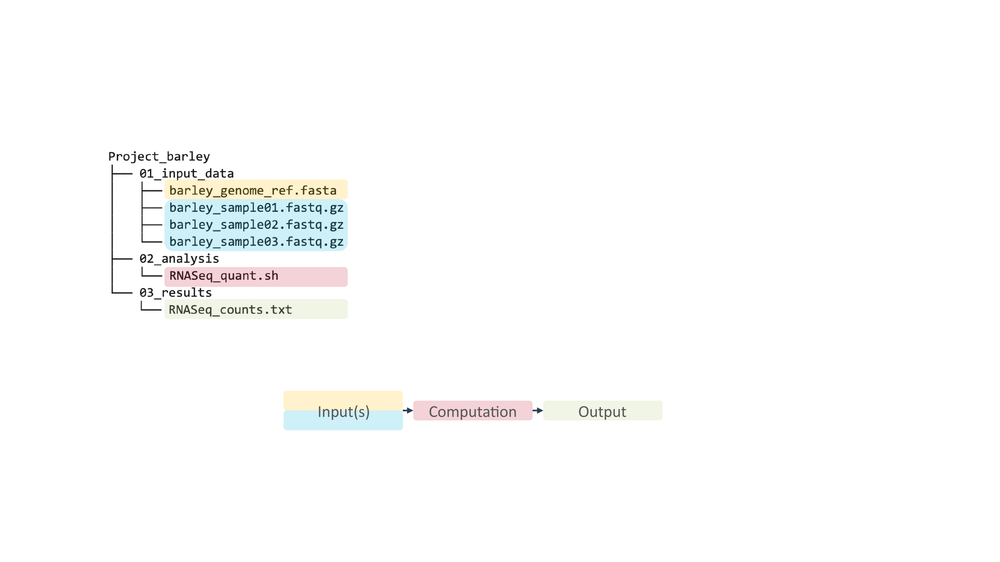
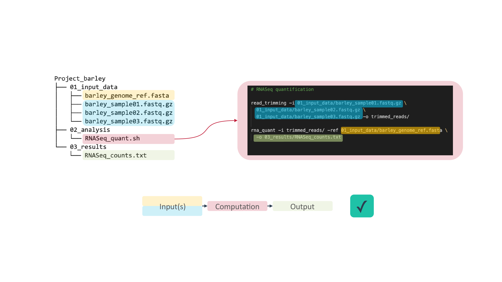
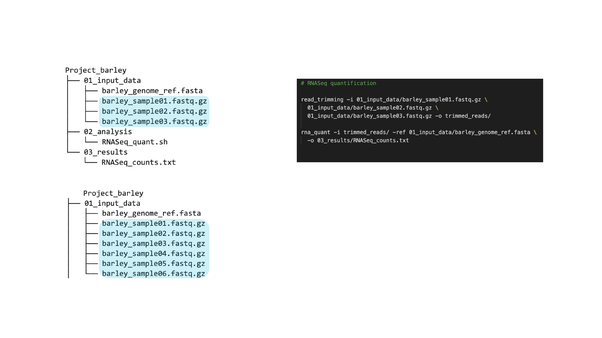
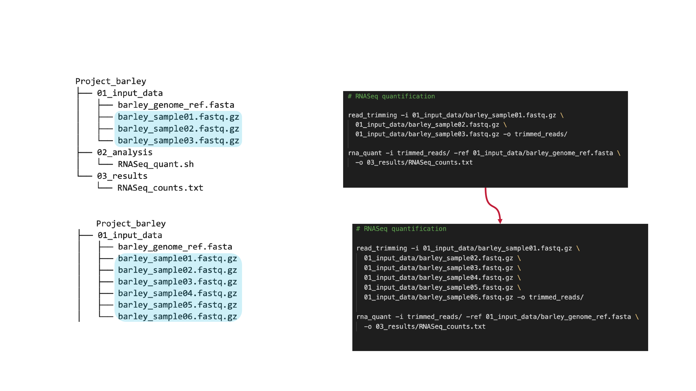
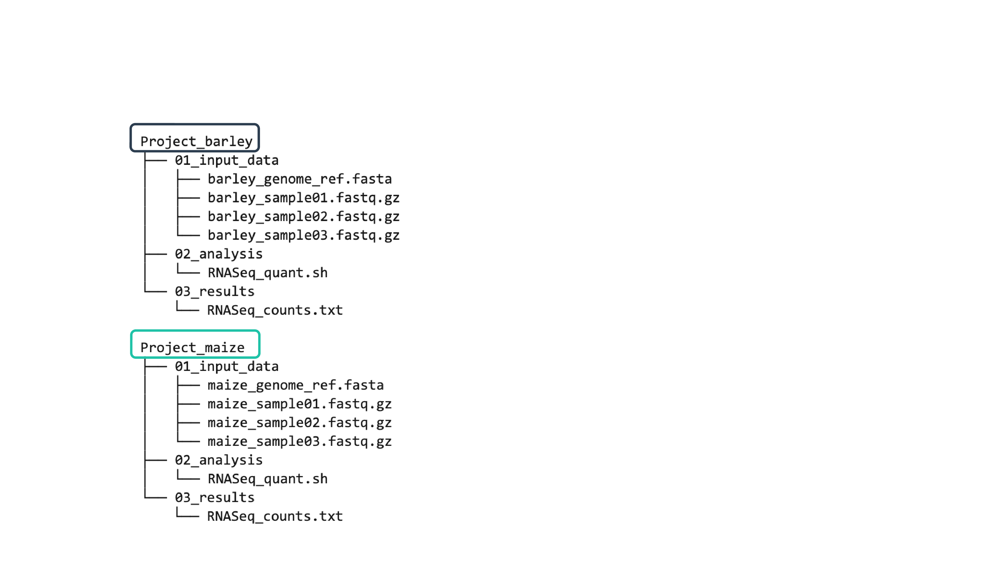
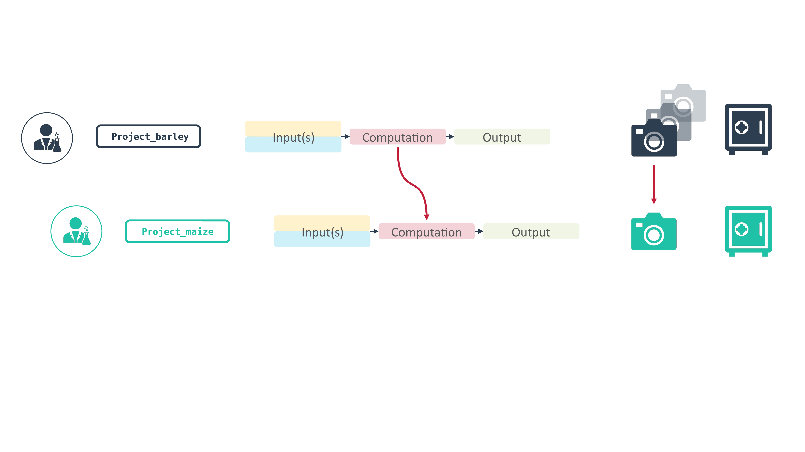
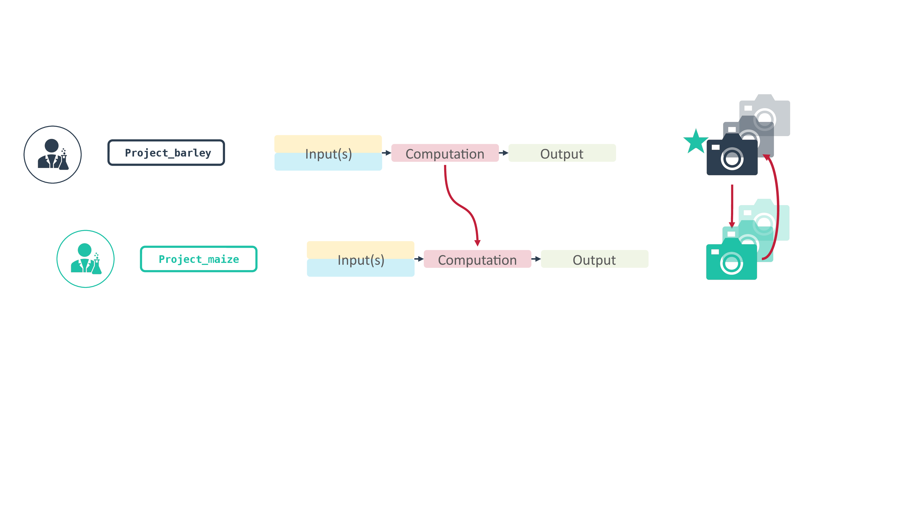
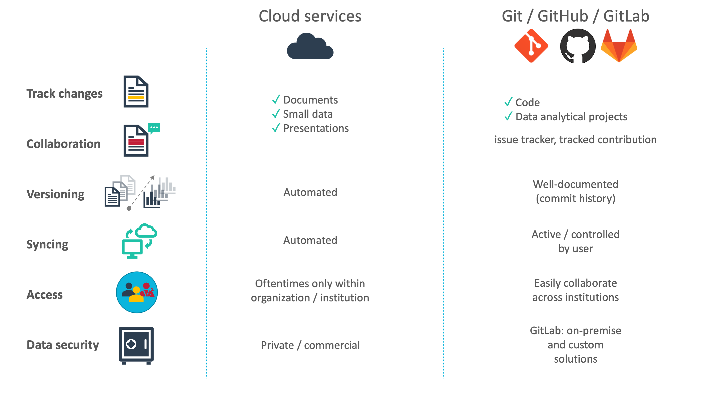

# Introduction to Git and git-based platforms

---

# Cloud Services

✓ Documents  
✓ Small data  
✓ Presentations  

X  Code  
X  Data analytical projects  
X  Big (“raw”) data  

---

# Git and git platforms

∼ Documents
✓ Small data  
∼ Presentations

✓✓ Code
✓✓ Data analytical projects
∼ Big (“raw”) data

---

# Why git? ≈> Why code?

- Save time
- Avoid doing repetitive tasks “by hand”
- Reuse scripts, analyses, pipelines
- Reproduce results

---

# A simple example: RNASeq project

---

# A simple example: RNASeq project

---

# A simple example: RNASeq project

---

# A simple example: RNASeq project

---

# A simple example: RNASeq project

---

# Take snapshots of your code work…
(... as long as it works)

---

# Take snapshots of your code work…
(... as long as it works)

---

# Scenario 1: More data

---

# Scenario 1: More data

---

# Scenario 1: More data

---

# Let git track changes and keep things clean

---

# Scenario 2: Pipeline breaks

---

# Revert to snapshot

---

# Scenario 3: New project, same type of data and analysis <!-- fit -->

---

# Scenario 3: New project, same type of data and analysis <!-- fit -->

---

# Re-use code

---

# Re-use code

---

# Re-use code – People have done this

---

# Re-use code – People have done this

---

# Re-use code – Link and contribute

---

# Git: summary

- Version control system
- Git “repository” = a central data package (directory)
- Allows to track changes to any file in the repository
  - **What** was changed
  - **When** was it changed
  - By **whom** was it changed
  - **Why** was it changed?

<!-- TODO: Thin out below walls of text -->

---

# GitHub and GitLab

- A well-documented cloud environment
- Active syncing
- Not automatically synced
- Non-automated version control
- You have the control what changes to track and what to sync
- Time machine to go back to older versions

---

# GitHub and Gitlab team projects

Simplifies concurrent work & merging changes
- Online service to host our projects
- Share code with other developers
- Others can download our projects, work on and contribute to them
- They can upload their changes and merge them with the main project

---

# Cloud vs. Git

---
---

# Code Notebooks

- <https://jupyter.org/>
- <http://rmarkdown.rstudio.com>

**Good**

- Document and comment code
- Local sharing (mostly reproducible, executable code)
- Interactive (good start for non-coders)

**Intermediate**

- Reproducibility (package / library dependencies)
- Version control (e.g. git plugin)

---

# Computational workflow languages

- Describe analysis workflows and tools
- Make them portable and scalable
- Across a variety of environments (software and hardware)

<!-- - <https://www.docker.com>
- singularity -->
<https://www.commonwl.org>
<https://www.nextflow.io>
<https://nf-co.re/>
<https://snakemake.github.io>
 
<https://galaxyproject.eu/>

<!-- ################# -->
<!-- Source to following slide(s) -->
<!-- ./bricks/exercise_017_FAIRProject_final.md -->
<!-- ################# -->

