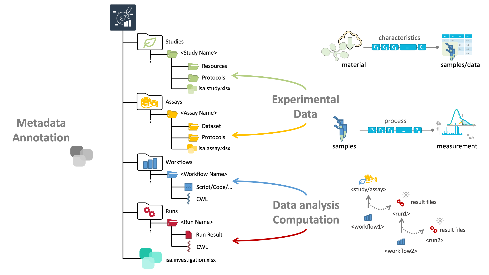
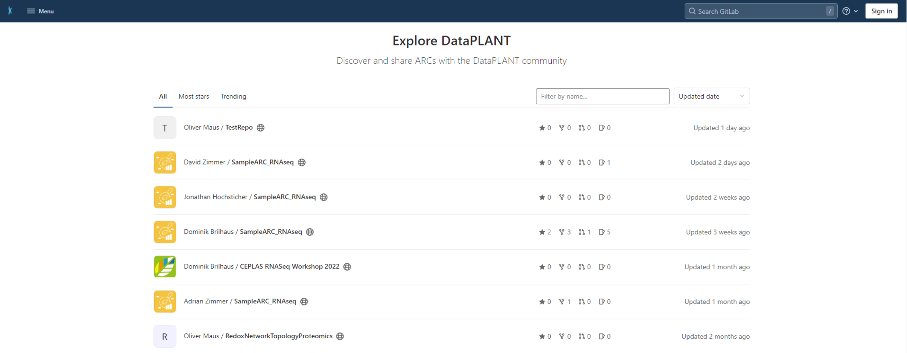

---

license: '[CC-BY 4.0](https://creativecommons.org/licenses/by/4.0/)'
layout: docs
author:
- name: Dominik Brilhaus
  github: https://github.com/brilator
  orcid: https://orcid.org/0000-0001-9021-3197
date: 2023-10-31
status: ready
title: The ARC Club
---

a two-day adventure to prepare your lab for the ARC universe

Dominik Brilhaus &ndash; CEPLAS Data Science

<!-- 
# Annotated Research Context (ARC)

# The ARC &ndash; a package for your research data

# The DataHUB &ndash; a place to share your ARCs

DataHUB: https://git.nfdi4plants.org/

## Status quo: Institute FileShare

## Moving from FileShare to DataHUB

## Moving from FileShare to DataHUB &ndash; *via* ARCs

## There's a tiny burden

 -->

## Goals

- Move existing datasets into [ARCs](./../../../implementation/AnnotatedResearchContext.html)
- Share them via the [DataHUB](./../../../implementation/DataHub.html)
  - This can be done privately, group-internally or publicly
- First few steps into the ARC ecosystem
  - We will not produce "perfect" or "final" ARCs
  - You or collaborators can pick them up from there in the future

## Setting

- Good internet connection
- Ideally isolated from lab // office // daily duties
- Access to the data to be ARCified (file share, hard disks, cloud)
- Agile, communicative, collaborative, positive
- Technical *ad-hoc* support by DataPLANT

## Rough Schedule

### Day 1

Time | Content
--- | ---
Morning | - Tech-check (Installation)   - Intro ARC, ARC Commander & DataHUB   - hands-on with dummy data
Lunch | *tbd* :hamburger:
Afternoon | - Discuss / assign projects   - Start creating ARCs
Evening | *tbd* :tropical_drink:

### Day 2

Time | Content
--- | ---
Morning | - Present project status   - Intro Swate   - hands-on with dummy data
Lunch | *tbd* :pizza: 
Afternoon | - Annotate experimental data   - Start creating ARCs
Evening | *tbd* :beers:

## Participants

This event benefits from a good mix of participants from you lab.

- wet
- data handlers, data users
- long-term lab-associates

Group size: 5-10

## Data

## Preparation

### Participants

Please prepare the following before the workshop

- Bring your laptop / computer
- Bring datasets to be ARCified
- Sign up for a DataHUB user account https://register.nfdi4plants.org/
  - Please add your `Project/consortium` (e.g. CEPLAS, SFB, TRR) and choose the role `Guest`

- Find the **command-line interface (CLI)** on your system.
  - On Windows: Enter `powershell` or `cmd` into the explorer path
  - On MacOS: Search `terminal` via spotlight (&#8984; + &#9251;) or navigate to `Applications` -> `Utilities` -> `Terminal`
  - No worries, we will not be using this a lot during the workshop. It's more for setup and trouble-shooting.
- Install <a href="https://git-scm.com/downloads" target="_blank">Git</a> and <a href="https://git-lfs.github.com/" target="_blank">Git LFS</a>
  - :bulb: Git LFS may already be installed with your Git installation (at least on Windows)
  - :bulb: For macOS we recommend to install via homebrew as described on the site above
- Install <a href="https://nfdi4plants.org/nfdi4plants.knowledgebase/docs/ArcCommanderManual/index-setup.html" target="_blank">ARC Commander</a>
- Install <a href="https://nfdi4plants.org/nfdi4plants.knowledgebase/docs/ARCitect-Manual/index.html" target="_blank">ARCitect</a>
- Install <a href="https://nfdi4plants.org/nfdi4plants.knowledgebase/docs/SwateManual/Docs01-Installing-Swate.html" target="_blank">Swate</a>

:bulb: Not all installations are perfectly straight-forward. We will start the first day with a tech-check to make sure your machine is up and running.

### Co-organizer (from lab)

- Room with good internet connection
  - Wifi via Eduroam
  - or LAN sockets (might require to setup LAN with local computing center)
- LAN cables
  - if good wifi is not available
- Multi-outlet power strip
- (optional) Coffee, Tea, Drinks, fruits and snacks
- Discuss putative datasets or projects to be ARCified (with the PI or the participants)
- Create a [DataHUB user group](./../../../DataHUB-Manual/datahub-CreateGroup.html)
  - (optional) invite members from your lab
