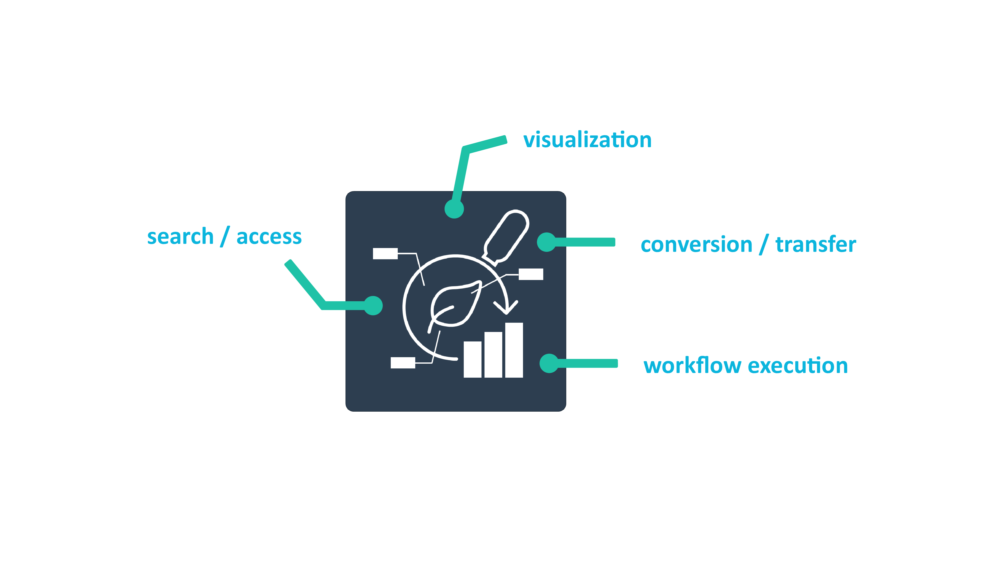

# Annotated Research Context (ARC)

<!-- Source to slide(s) -->
<!-- ../../bricks/ARC_DataCentricIntegration.md -->

---

# What does an ARC look like?

<!-- Source to slide(s) -->
<!-- ../../bricks/ARC_Structure_DataPLANT-1Folder_Structure.md -->

---

# What does an ARC look like?

<!-- Source to slide(s) -->
<!-- ../../bricks/ARC_Structure_DataPLANT-2Folder_Structure_ExperimentalData.md -->

---

# What does an ARC look like?

<!-- Source to slide(s) -->
<!-- ../../bricks/ARC_Structure_DataPLANT-3Folder_Structure_ExperimentalData_Images.md -->

---

# What does an ARC look like?

<!-- Source to slide(s) -->
<!-- ../../bricks/ARC_Structure_DataPLANT-4Folder_Structure_DataAnalysis-Computation.md -->

---

# What does an ARC look like?

<!-- Source to slide(s) -->
<!-- ../../bricks/ARC_Structure_DataPLANT-5Folder_Structure_DataAnalysis-Computation_Images.md -->

---

# What does an ARC look like?

<!-- Source to slide(s) -->
<!-- ../../bricks/ARC_Structure_DataPLANT-6Folder_Structure_MetadataAnnotation.md -->
