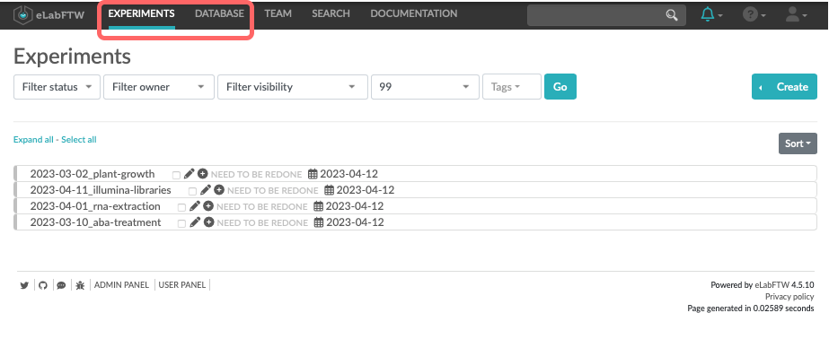

# elabFTW // ARC

Dominik Brilhaus - April 13, 2023

## Example Scenario

1. You use **ARCs** to

   - organize and store your (raw) data locally
   - share and communicate data with collaboration partners
   - annotate and prepare your data for publication

2. You use **elabFTW** to

   - document your daily lab work "on the fly"
   - organize lab routines with colleagues

## Goals

1. Benefit from "both worlds" (ARC and elabFTW)

   - iteratively work on protocols
   - be able to associate metadata to the raw data

2. Align elabFTW structure and ARCs

<!-- :bulb: Note, the following slides outline the overlapping concepts of elabFTW a manual approach. -->

## Local ARCs - <br> Project overview


## Local ARCs - <br> Project overview


## Local ARCs - <br> Protocols


## DataHUB

https://git.nfdi4plants.org

## Example ARC DataHUB - project overview


## Example ARC DataHUB - ARC overview


## Example ARC DataHUB - assay protocols


## Example ARC DataHUB - protocol detail


## elabFTW - Overview



elabFTW data is mainly divided in two main categories (panels)

> `Experiments`  
> 
> `Database`

### Experiment Panel


The `Experiment` panel is the default "working area" for protocols of daily lab work

### Database Panel


The `Database` panel is elabFTW`s place to categorize contents


### Database item types

:bulb: Item types can be defined in the `Admin Panel` (bottom)

1. Admin customizes types of items


## Preparing database lists for elabFTW import

:bulb: elabFTW offers batch-import from csv.

- elabFTW offers to import data from a csv file as described here: https://doc.elabftw.net/user-guide.html#importing-from-a-csv-file
- These can be imported as any type of database item or experiment
- elabFTW-specific columns
  - `title`: will be the displayed name of the individual item
  - `tags`: (separated by `|`) will be used as tags

### Database import


### Database import example - Investigations

`db_investigations.csv`

title | tags | Investigation Identifier | Investigation Person Last Name | Investigation Person First Name | Investigation Person Email | Investigation Person Phone
------|------|--------------------------|--------------------------------|---------------------------------|----------------------------|---------------------------
inv001-talinum-cam | inv001-talinum-cam | inv001-talinum-cam | Beetroot | Jasmine | jasmine.beetroot@arc-uni.org | 0211-0212
inv002-arabidopsis-heat | inv002-arabidopsis-heat | inv002-arabidopsis-heat | Sage | Oliver | oliver.sage@arc-uni.org | 0211-0213
inv003-welwitschia-clock | inv003-welwitschia-clock | inv003-welwitschia-clock | Sugarcane | Viola | viola.sugarcane@arc-uni.org | 0211-0214

### Database import example - Studies

`exp_inv001-talinum-cam_studies.csv`


title | tags | Study Identifier | Study Title | Study Description
------|------|------------------|-------------|-------------------
sty01-aba-pre-experiment | inv001-talinum-cam | sty01-aba-pre-experiment | Pre-experiment to test ABA treatment | ABA treatment
sty02-aba-full | inv001-talinum-cam | sty02-aba-full | Large scale experiment with ABA | ABA treatment
sty03-aba-timeseries | inv001-talinum-cam | sty03-aba-timeseries | Time series experiment with ABA | Time Series Design


### Database import


### Database import


### Database Panel


### Linking / grouping items

:bulb: Two mechanisms

1. Tags
   1. user-friendly, easy way to group items
2. Linking
   1. Database items
   2. Experiment items

### Linking items

In edit mode


### Linked items


##

## Demo

:construction: The following slides are attached to prep a demo 

## Creating the ARC structure locally (demo)

### settings

```bash
gitlab_base_url=https://git.nfdi4plants.org/elab-demo-arcs/
arc_dir_local=~/gitlab_dataplant/elab-demo-arcs
```

### create a first arc

:bulb: This is a line-by-line example to initiate and share an ARC with a few studies and assays

```bash
arc_name=inv001-talinum-cam

mkdir -p "$arc_dir_local"/"$arc_name"
cd "$arc_dir_local"/"$arc_name"

arc init
arc investigation create -i "$arc_name"

arc study add -s sty01-aba-pre-experiment
arc assay add -s sty01-aba-pre-experiment -a sty01-asy01-acidity

arc study add -s sty02-aba-full
arc assay add -s sty02-aba-full -a sty02-asy01-acidity
arc assay add -s sty02-aba-full -a sty02-asy02-starch-content
arc assay add -s sty02-aba-full -a sty02-asy04-pepc-activity

arc study add -s sty03-aba-timeseries
arc assay add -s sty03-aba-timeseries -a sty03-asy01-plant-pictures
arc assay add -s sty03-aba-timeseries -a sty03-asy02-acidity
arc assay add -s sty03-aba-timeseries -a sty03-asy03-starch-content
arc assay add -s sty03-aba-timeseries -a sty03-asy04-chlorophyll-content
arc assay add -s sty03-aba-timeseries -a sty03-asy05-pepc-activity
arc assay add -s sty03-aba-timeseries -a sty03-asy06-rnaseq

arc sync -f -r "$gitlab_base_url""$arc_name" -m "initialize ARC structure"

```

### create and push more arcs (for loop)

```bash
for arc_name in inv002-arabidopsis-heat inv003-welwitschia-clock; do
  echo $arc_name
  mkdir -p "$arc_dir_local"/"$arc_name"
  cd "$arc_dir_local"/"$arc_name"    
  arc init
  arc investigation create -i "$arc_name"
  arc sync -f -r "$gitlab_base_url""$arc_name" -m "initialize ARC structure $arc_name"
done
```
